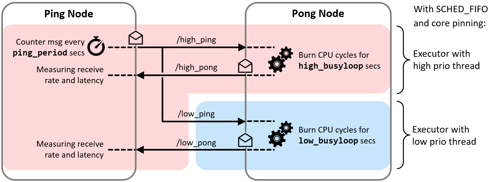

# examples_rclcpp_cbg_executor

The *examples_rclcpp_cbg_executor* package provides a demo and test bench for the *Callback-group-level Executor* concept. This concept was developed in 2018 and has been integrated in ROS 2 mainline in 2020, i.e., is available from ROS 2 Galactic on. It does not add a new Executor but leverages callback groups for refining the Executor API to callback-group-level granularity.

This allows a single node to have callbacks with different real-time requirements assigned to different Executor instances – within one process. Thus, an Executor instance can be dedicated to one or few specific callback groups and the Executor’s thread (or threads) can be prioritized according to the real-time requirements of these groups. For example, all critical callbacks may be handled by an Executor instance based on an thread running at the highest scheduler priority.

## Introduction to demo

The demo comprises a *Ping Node* and a *Pong Node* which exchange messages on two communication paths simultaneously. There is a high priority path formed by the topics *high_ping* and *high_pong* and a low priority path formed by *low_ping* and *low_pong*, respectively.



The Ping Node sends ping messages on both paths simultaneously at a configurable rate. The Pong Node takes these ping messages and replies each of them. Before sending a reply, it burns a configurable number of CPU cycles (thereby varying the processor load) to simulate some message processing.

All callbacks of the Ping Node (i.e., for the timer for sending ping messages and for the two subscription on high_pong and low_pong) are handled in one callback group and thus Executor instance. However, the two callbacks of the Pong Node that process the incoming ping messages and answer with a pong message are assigned to two different callback groups. In the main function, these two groups are distributed to two Executor instances and threads. Both threads are pinned to the same CPU (No. 0) and thus share its processing power, but with different scheduler priorities following the names *high* and *low*.

## Running the demo

The Ping Node and Pong Node may be either started in one process or in two processes. Please note that on Linux the demo requires sudo privileges to be able to change the thread priorities using `pthread_setschedparam(..)`.

Running the two nodes in one process:

```bash
sudo bash
source /opt/ros/[ROS_DISTRO]/setup.bash
ros2 run examples_rclcpp_cbg_executor ping_pong
```

Example of a typical output - note the zero pongs received on the low prio path:

```
[INFO] [..] [pong_node]: Running experiment from now on for 10 seconds ...
[INFO] [..] [ping_node]: Both paths: Sent out 953 of configured 1000 pings, i.e. 95%.
[INFO] [..] [ping_node]: High prio path: Received 951 pongs, i.e. for 99% of the pings.
[INFO] [..] [ping_node]: High prio path: Average RTT is 14.0ms.
[INFO] [..] [ping_node]: High prio path: Jitter of RTT is 7.460ms.
[INFO] [..] [ping_node]: Low prio path: Received 0 pongs, i.e. for 0% of the pings.
[INFO] [..] [pong_node]: High priority executor thread ran for 9542ms.
[INFO] [..] [pong_node]: Low priority executor thread ran for 0ms.
```

Note: On Linux, the two Executor threads, which are both scheduled under `SCHED_FIFO`, can consume only 95% of the CPU time due to [RT throttling](https://wiki.linuxfoundation.org/realtime/documentation/technical_basics/sched_rt_throttling).

Running the two nodes in separate processes:

```bash
sudo bash
source /opt/ros/[ROS_DISTRO]/setup.bash
ros2 run examples_rclcpp_cbg_executor ping
```

```bash
sudo bash
source /opt/ros/[ROS_DISTRO]/setup.bash
ros2 run examples_rclcpp_cbg_executor pong
```

The two processes should be started simultaneously as the experiment runtime is just 10 seconds.

## Parameters

There are three parameters to configure the experiment:

* `ping_period` - period (double value in seconds) for sending out pings on the topics high_ping and low_ping simultaneously in the Ping Node.
* `high_busyloop` - duration (double value in seconds) for burning CPU cycles on receiving a message from high_ping in the Pong Node.
* `low_busyloop` - duration (double value in seconds) for burning CPU cycles on receiving a message from low_ping in the Pong Node.

The default values are 0.01 seconds for all three parameters.

Example for changing the values on the command line:

```bash
ros2 run examples_rclcpp_cbg_executor ping_pong --ros-args -p ping_period:=0.033 -p high_busyloop:=0.025
```

With these values, about (0.033s - 0.025s) / 0.010s = 80% of the ping messages on the low prio path should be processed and answered by a pong message:

```
...
[INFO] [..] [ping_node]: Both paths: Sent out 294 of configured 303 pings, i.e. 97%.
[INFO] [..] [ping_node]: High prio path: Received 293 pongs, i.e. for 99% of the pings.
[INFO] [..] [ping_node]: High prio path: Average RTT is 26.2ms.
[INFO] [..] [ping_node]: High prio path: Jitter of RTT is 7.654ms.
[INFO] [..] [ping_node]: Low prio path: Received 216 pongs, i.e. for 73% of the pings.
[INFO] [..] [ping_node]: Low prio path: Average RTT is 202.5ms.
[INFO] [..] [ping_node]: Low prio path: Jitter of RTT is 36.301ms.
...
```

## Implementation details

The Ping Node and the Pong Node are implemented in two classes `PingNode` (see [ping_node.hpp](include/examples_rclcpp_cbg_executor/ping_node.hpp)) and `PongNode` (see [pong_node.hpp](include/examples_rclcpp_cbg_executor/pong_node.hpp)), respectively. In addition to the mentioned timer and subscriptions, the PingNode class provides a function `print_statistics()` to print statistics on the number of sent and received messages on each path and the average round trip times. To burn the specified number of CPU cycles, the PongNode class contains a function `burn_cpu_cycles(duration)` to simulate a given processing time before replying with a pong.

The Ping and Pong nodes, the two executors, etc. are composed and configured in the `main(..)` function of [main.cpp](src/main.cpp). This function also starts and ends the experiment for a duration of 10 seconds and prints out the throughput and round trip time (RTT) statistics.

The demo also runs on Windows, where the two threads are prioritized as *above normal* and *below normal*, respectively, which does not require elevated privileges. When running the demo on Linux without sudo privileges, a warning is shown but the execution is not stopped.

## Known issues

On macOS the core pinning failed silently in our experiments. Please see the function `configure_native_thread(..)` in [utilities.hpp](src/examples_rclcpp_cbg_executor/utilities.hpp) for details.