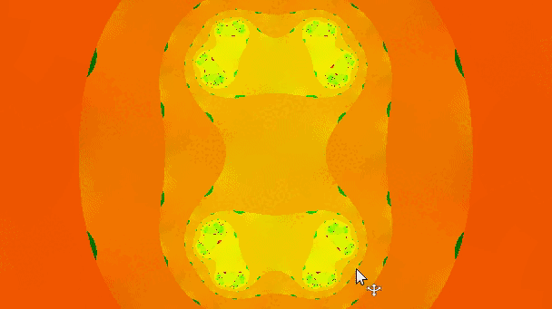
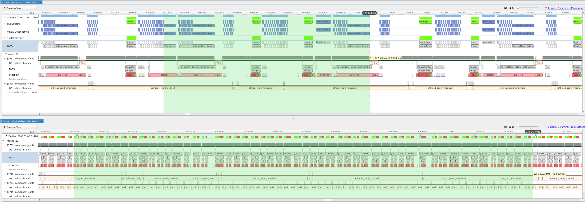
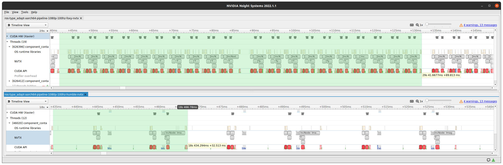

# Type Adaptation Examples - HW Accelerated Pipelines

This directory contains packages that demonstrate use of the Type Adaptation Feature as listed in [REP 2007](https://ros.org/reps/rep-2007.html). 

There are three packages as follows:
  * `example_type_adapters` : This package implements a custom user defined ROS type for an image (`type_adaptation::example_type_adapters::ImageContainer`).
  * `julia_set`: An example that computes [Julia Set](https://en.wikipedia.org/wiki/Julia_set) on an incoming image. 
  * `simple_increment`: A trivial example that increases each pixel value by 1 on an incoming image. 

Examples show a GPU (HW accelerator) pipeline that is performing CUDA operations in a chain of intra-process nodes optimized to reduce unnecessary memory copy during message transport and eliminate unnecessary GPU to CPU synchronization.

## Julia Set Pipeline
<div align="center"></div>
In this example, the Julia Set is computed on an incoming image to generate fractals. This is a compute intensive task which can be offloaded to a hardware accelerator such as a GPU. Additionally, type adaptation is leveraged to reduce transport overhead. This example showcases performance improvements of a pipeline and can be adopted to other compute intensive workloads.

* `map_node` - Transforms input image width and height to X and Y coordinate axes, then republishes the normalized image.

* `julia_set_node` - Performs N-stages of "processing" (computing Julia Set) using CUDA.

* `colorize_node` - Colorizes the output from `julia_set_node`.

Construction of the pipeline:

* `map_node` subscribes to a `type_adaptation::example_type_adapters::ImageContainer` type then it passes the normalized image to the next *N* `julia_set_node`.
* Generation of fractals are done b *N* `julia_set_node` nodes each computing one iteration of the whole computation.
* Final result generated by *Nth* `julia_set_node` is then passed to the `colorize_node` to generate a fractal image.


Variations in pipelines: 
1. Type adaptation **enabled**: In this mode, user defined type (`type_adaptation::example_type_adapters::ImageContainer`) is used through out the pipeline.
2. Type adaptation **disabled**: In this mode, `sensor_msgs::msg::Image` is used through out the pipeline.

### Launch file parameters

| Parameter            | Type     | Default                  | Description                                                |
| -------------------- | -------- | ------------------------ | ---------------------------------------------------------- |
| `enable_type_adapt`  | `bool`   | `true`                   | Enable type adaptation mode                                |
| `resolution`         | `string` | `1080p`                  | Resolution key for images (16K \| 8K \| 4K \| 1080p \| 720p \| 480p) |
| `enable_mt`          | `bool`   | `false`                  | Enable multithreaded composable containers                 |
| `enable_nsys`        | `bool`   | `false`                  | Enable nsys profiling                                      |
| `nsys_profile_label` | `string` | `''`                     | Label to append for nsys profile output                    |
| `nsys_profile_flags` | `string` | `--trace=osrt,nvtx,cuda` | Flags for nsys profile output                              |


## Simple Increment Pipeline
A simple pipeline in which interconnected nodes increases each pixel value by 1 of an incoming image message.

* `inc_node` - subscribes to a `type_adaptation::example_type_adapters::ImageContainer` type on the 'image_in' topic.  Performs N-stages of "processing" (add 1) to each pixel in the image using CUDA, then republishes the image to the 'image_out' topic as a `type_adaptation::example_type_adapters::ImageContainer` type.

Variations in pipelines: 
1. A single `inc_node` that performs *N* steps inline and outputting on `/composite/image_out`.
2. A chain of *N* `inc_node` instances chained together, outputting on `/pipeline/image_out` 

The goal is to have the throughput of `/pipeline/image_out` match that of `/composite/image_out`. This can be achieved by enabling type adaptation. When type adaptation is disabled, the bigger the image size used, the more unnecessary memory copying during message transport. This slows the pipeline down relative to the composite node with *N* steps inline. 

There are the following parameters for `inc_node`:
* `type_adaptation_enabled` - When true, `inc_node` subscribes and publishes `type_adaptation::example_type_adapters::ImageContainer` type messages. And when false, `sensor_msgs::msg::Image` type is used for subscription and publisher.
* `inplace_enabled` - When true, configures inc_node to directly modify the received CUDA buffer rather than always copy it first.
* `proc_count` - The number of increment operations to perform on an image.

### Launch file parameters

| Parameter            | Type     | Default                  | Description                                                          |
| -------------------- | -------- | ------------------------ | -------------------------------------------------------------------- |
| `config`             | `string` | `pipeline`               | Graph configuration (pipeline \| composite)                          |
| `enable_type_adapt`  | `bool`   | `true`                   | Enable type adaptation mode                                          |
| `resolution`         | `string` | `1080p`                  | Resolution key for images (16K \| 8K \| 4K \| 1080p \| 720p \| 480p) |
| `enable_mt`          | `bool`   | `false`                  | Enable multithreaded composable containers                           |
| `enable_nsys`        | `bool`   | `false`                  | Enable nsys profiling                                                |
| `nsys_profile_label` | `string` | `''`                     | Label to append for nsys profile output                              |
| `nsys_profile_flags` | `string` | `--trace=osrt,nvtx,cuda` | Flags for nsys profile                                               |


## Running the pipelines
### Bringing in the dependencies
To generate input and show output images, we will use the [image_tools](https://github.com/ros2/demos/tree/humble/image_tools) package.

First, clone the repository in your ROS workspace

```
git clone -b humble https://github.com/ros2/demos.git
```

Once done, build the `image_tools` package

```
colcon build --packages-up-to image_tools
```

### Building the pipeline packages

```
colcon build --packages-up-to julia_set simple_increment --event-handlers console_direct+
```

### Running the Julia Set pipeline:
```
ros2 launch julia_set julia_set-pipeline-launch.py
```

### Display the generated fractals:
```
ros2 run image_tools showimage --ros-args -r image:=pipeline/image_out
```

### Running the Simple Increment pipeline:
```
ros2 launch simple_increment inc-pipeline-launch.py
```

### Display the final image:

Display the final image from the "pipeline" branch:
```
ros2 run image_tools showimage --ros-args -r image:=pipeline/image_out
```
Display the final image from the "composite" branch:
```
ros2 run image_tools showimage --ros-args -r image:=composite/image_out
```

### Measure performance

Pipeline (N nodes in sequence)
```
ros2 topic hz /pipeline/image_out | sed -n 's/.*average rate: \([0-9]*\.[0-9]*\)/Pipeline fps: \1 hz/p'
```

Composite (one node with N operations)
```
ros2 topic hz /composite/image_out | sed -n 's/.*average rate: \([0-9]*\.[0-9]*\)/Composite fps: \1 hz/p'
```

### Profiling 
For analysing the profiles of the pipelines, we are using [Nvidia Nsight Systems](https://developer.nvidia.com/nsight-systems)

Julia Set Pipeline:

To verify the performance improvement of the pipeline, we can compare the profiles of two different runs. One with type adaptation enabled and the other one with type adaptation disabled.

Collecting profiles:

Case1: type adaptation enabled
```
ros2 launch julia_set julia_set-pipeline-launch.py -- enable_type_adapt:=true enable_nsys:=true
```

Case2: type adaptation disabled
```
ros2 launch julia_set julia_set-pipeline-launch.py -- enable_type_adapt:=false enable_nsys:=true
```
The screenshot below shows comparision between the two cases. The top profile is with type adaptation enabled and the bottom one is with type adaptation disabled. Notice the time shown by the tool-tip in yellow (*23.778ms* and *793.086ms*), it corresponds to the average fps reported by the `ros2 topic hz /pipeline/image_out` command.
<div align="center"></div>
</br>

Simple Increment Pipeline:

To verify the performance improvement of the pipeline across different ROS2 versions, we can compare the profiles of two different runs. One with ROS2 Foxy and the other one with ROS2 Humble.

Collecting profiles:
```
ros2 launch simple_increment inc-pipeline-launch.py -- enable_nsys:=true
```
In the screenshot below top profile is with ROS2 Foxy and the bottom one is with ROS2 Humble. Notice the time shown by the tool-tip in yellow (*89.813ms* and *32.513ms*), it corresponds to the average fps reported by the `ros2 topic hz /pipeline/image_out` command.

<div align="center"></div>
